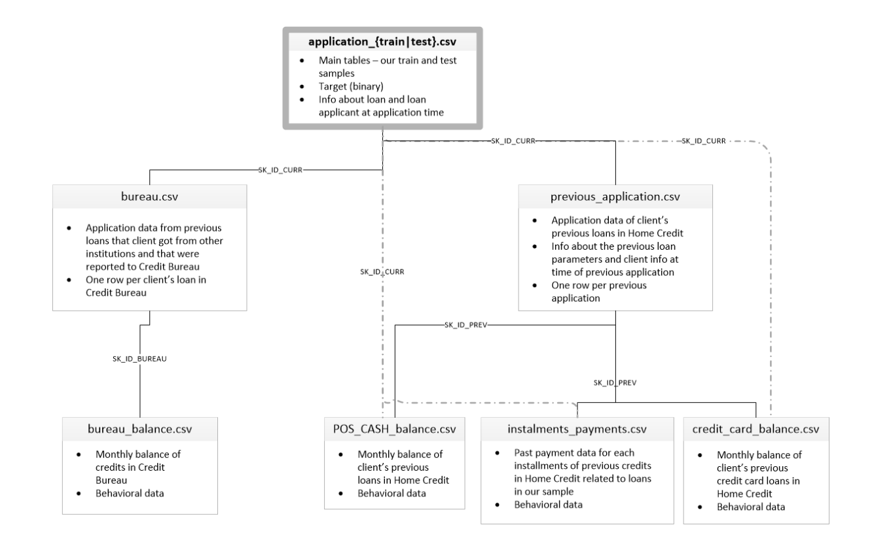

# Credit Risk


[Link in Kaggle](https://www.kaggle.com/competitions/home-credit-default-risk/overview)

Small credit scoring project using a LightGBM model.

The API can:

- generate a fake loan applicant
- store all clients in the `gold` table
- retrieve a client by `SK_ID_CURR`
- predict credit risk from the stored client features

## Start the database

```bash
docker compose up -d
```

Open psql if needed:

```bash
docker exec -it postgres_db psql -U golduser -d mydatabase
```

## Prepare the gold table

```bash
python -m src.pipelines.refresh_gold
python -m src.db.create_table
```

## Start the API

```bash
uvicorn src.api.main:app --reload
```

API docs:

```text
http://127.0.0.1:8000/docs
```

## Start the frontend

From the project root:

```bash
python -m http.server 5500
```

Then open:

```text
http://127.0.0.1:5500/frontend/
```

## Notes

- PostgreSQL connection is configured in `src/config.py`.
- The main table is `gold`.
- Model files are stored in `artifacts/model/`.
